# Sudoku Gladiators ⚔️

> A real-time cross-platform multiplayer Sudoku game — because Sudoku is better with someone to beat.

[](https://flutter.dev)
[](https://firebase.google.com)
[](https://flutter.dev/multi-platform)

---

## 🎬 Demo

[](https://www.youtube.com/watch?v=V-_eNQcfJ-Y)

---

## 📄 Documentation

| Document | Description |
|---|---|
| [📘 Bachelor's Thesis](thesis/Sudoku_Gladiators___Multiplayer_Sudoku_Game_Using_Flutter.pdf) | Full 70-page academic paper covering research, architecture, and implementation |
| [📊 Presentation](thesis/Sudoku%20Gladiators%20Presentation.pdf) | Slide deck presented at Babeș-Bolyai University |

---

## Overview

Sudoku Gladiators takes the classic single-player Sudoku experience and transforms it into a competitive and co-operative multiplayer game — with ranked matchmaking, powerups, real-time sync, and a global leaderboard. Built entirely with Flutter and Firebase, with no custom game server required.

This project was submitted as a Bachelor's thesis at the Faculty of Mathematics and Computer Science, Babeș-Bolyai University.

---

## 📸 Screenshots

### Home Screen
<p align="center">
  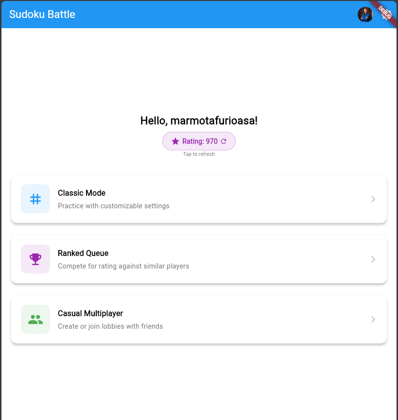
</p>

The home screen greets players by name, shows their current Elo rating, and offers three entry points: Classic Mode, Ranked Queue, and Casual Multiplayer.

---

### 🎮 Classic Singleplayer

<p align="center">
  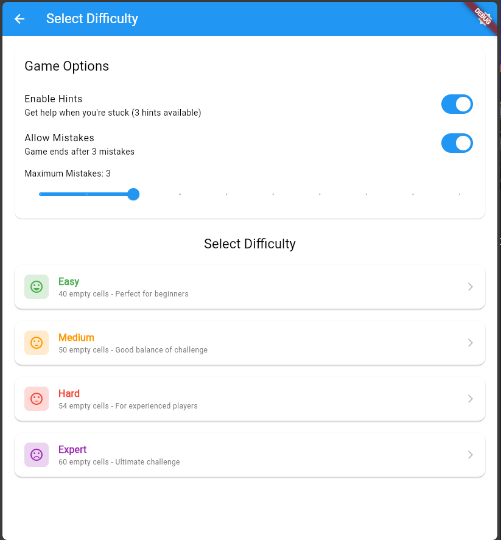
</p>

Solo play with fully customisable settings: choose your difficulty (Easy → Expert), toggle hints, and set how many mistakes are allowed before the game ends.

---

### 🏟️ Casual Multiplayer

**Finding a lobby**

<p align="center">
  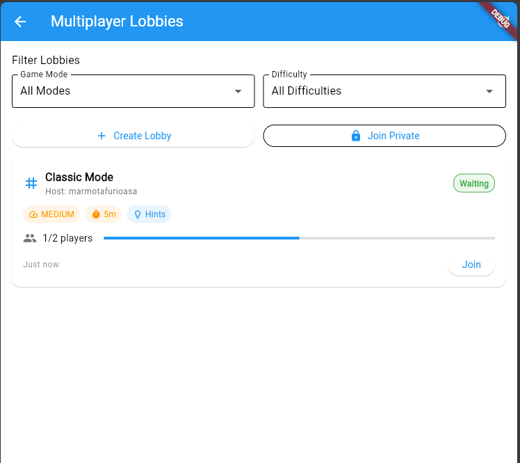
</p>

Browse open lobbies filtered by game mode and difficulty, or jump straight into a private lobby with an access code.

**Creating a lobby**

<p align="center">
  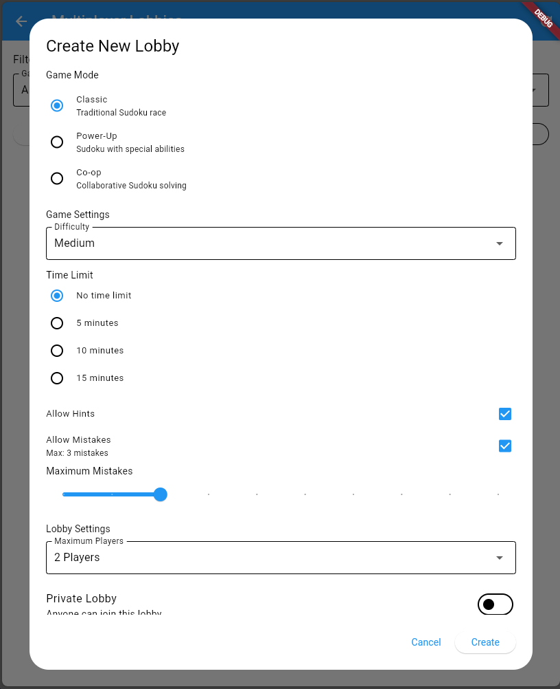
</p>

Hosts configure the full game session before anyone joins: game mode, difficulty, time limit, hints, mistake limit, player cap, and public/private visibility.

**Waiting room**

<p align="center">
  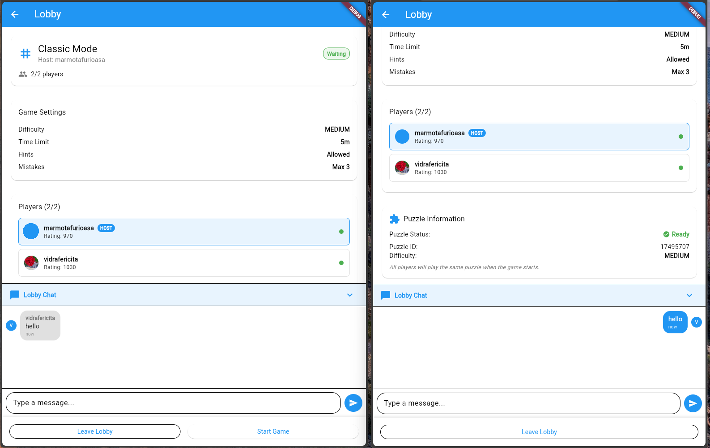
</p>

Both sides of the lobby waiting room shown side by side. The host sees a "Start Game" button; the guest sees puzzle information once it's generated. In-lobby chat is live before the game even begins.

---

### ⚔️ Classic Multiplayer (1v1)

<p align="center">
  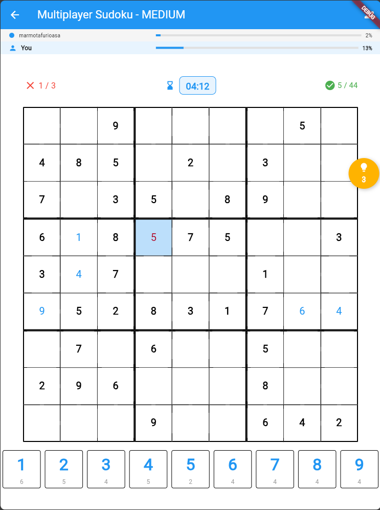
</p>

Both players race to complete the same puzzle. Progress bars at the top show how far each player has gotten in real time. Mistakes and completed cells are tracked per player.

---

### 🤝 Co-op Mode

<p align="center">
  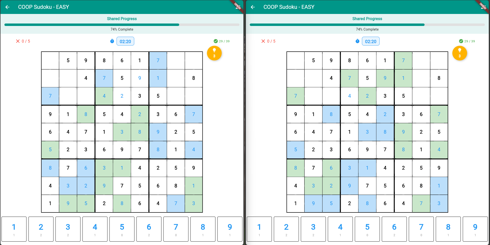
</p>

Two players share a single board. Blue cells are filled by you; green cells by your partner. A shared progress bar counts down to victory together.

---

### ⚡ Powerup Mode

**Claiming a powerup**

<p align="center">
  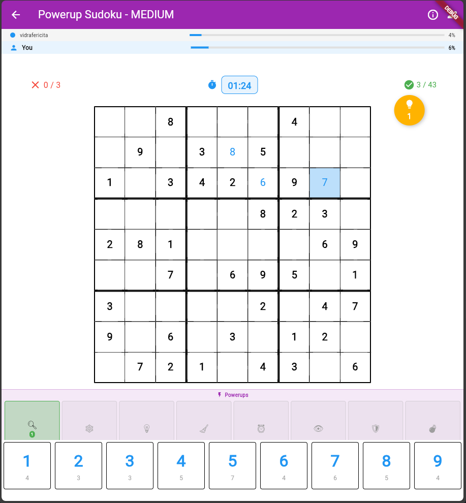
  &nbsp;&nbsp;
  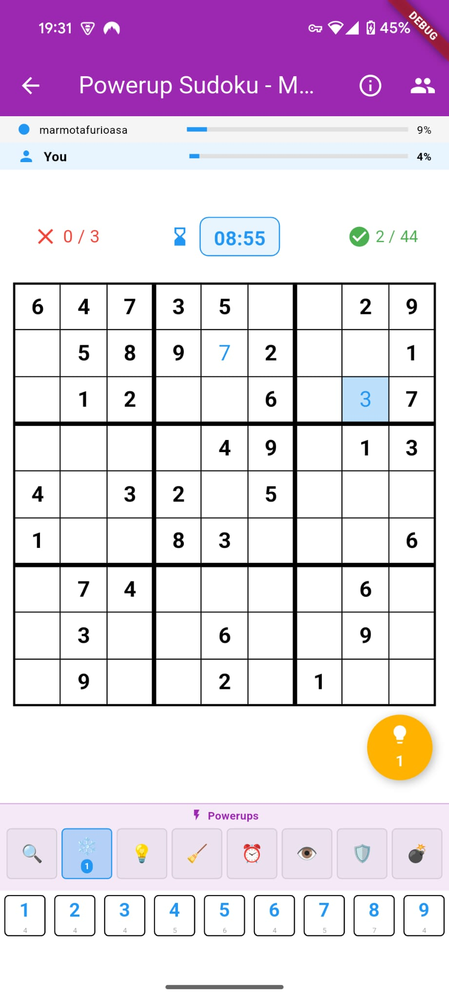
</p>

Powerups spawn on empty cells mid-game. Solve the cell to claim the powerup, then tap it from your tray to unleash it at the right moment.

**Powerup used — Freeze**

<p align="center">
  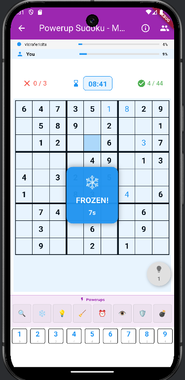
</p>

The Freeze powerup locks your opponent's input for 10 seconds — giving you precious breathing room to race ahead.

**Available powerups:**

| Powerup | Effect |
|---|---|
| 🔍 Reveal 2 Cells | Reveals the solution for two random empty cells |
| ❄️ Freeze Opponent | Freezes opponent's input for 10 seconds |
| 💡 Extra Hints | Grants +2 additional hints |
| 🧹 Clear Mistakes | Removes all current errors and resets mistake count |
| ⏰ Time Bonus | Adds 60 seconds to the game timer |
| 👁️ Show Solution | Briefly reveals the full solution for 3 seconds |
| 🛡️ Shield | Blocks the next incoming opponent powerup |
| 💣 Bomb | Clears a 3×3 area of the opponent's completed cells |

---

### 🏆 Ranked Queue

<p align="center">
  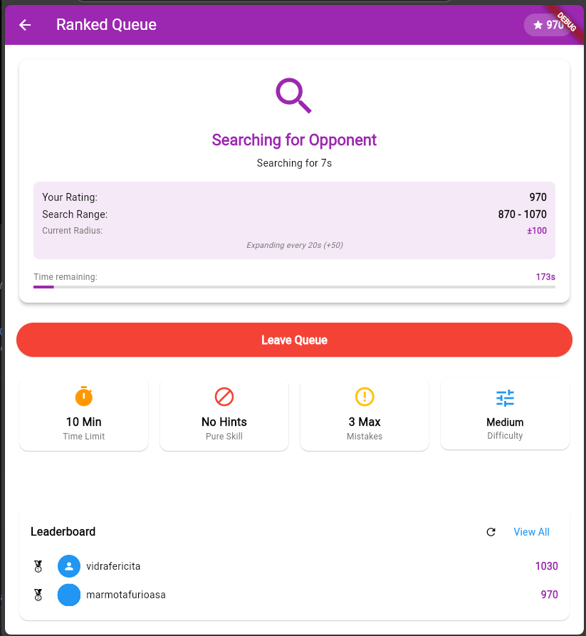
</p>

Ranked matches are played on Medium difficulty with no hints and a 10-minute time limit. The queue searches within ±100 Elo initially, expanding by ±50 every 20 seconds up to ±600. A live leaderboard is shown while you wait.

**Ranking System:**
- Starting rating: **1,000** for all players
- K-factor: **32**
- Queue timeout: **3 minutes**
- Atomic Firebase transactions prevent race conditions during matchmaking

---

## ✨ Features

### 🎮 Game Modes
| Mode | Description |
|---|---|
| **Classic Solo** | Standard Sudoku with difficulty selection and hints |
| **1v1 Competitive** | Race to complete the same board faster than your opponent |
| **Co-op** | Two players solve a shared board together, sharing hints and mistakes |
| **Powerup Mode** | 1v1 with powerups that spawn on the board mid-game |
| **Ranked** | Elo-based competitive queue with expanding search radius |

---

## 🏗️ Architecture

```
┌─────────────────────────────────────────────────────┐
│                   Flutter App                        │
│                                                      │
│  Screens          Providers         Services         │
│  ─────────        ─────────         ────────         │
│  AuthScreen    SudokuProvider    LobbyService        │
│  HomeScreen    LobbyProvider     RankingService      │
│  LobbyScreen   PowerupProvider   PowerupService      │
│  GameScreen    ThemeProvider     GameStateService    │
│  Leaderboard                                         │
│                                                      │
│              SudokuEngine (pure Dart)                │
└──────────────────────┬──────────────────────────────┘
                       │
              Firebase SDK (no custom server)
                       │
        ┌──────────────┼──────────────┐
        ▼              ▼              ▼
  Firebase Auth   Firestore DB   Firebase Storage
  (login/register) (game state)   (avatars)
```

### Serverless Multiplayer
All real-time multiplayer is handled through **Firestore listeners and atomic transactions** — no custom WebSocket server required. Each game state change writes to Firestore and all connected clients receive updates in real time via snapshot streams.

---

## 🧠 Sudoku Engine

The `SudokuEngine` class is a pure Dart implementation with no external dependencies:

**Puzzle Generation (2-phase):**
1. **Fill phase** — randomized backtracking fills a valid complete 9×9 grid, shuffling candidate numbers `[1-9]` at each cell for variety
2. **Remove phase** — cells are removed one at a time, checking after each removal that exactly one solution remains (via a bounded backtracking solver with `maxSolutions=2`). If removal would create ambiguity, the cell is restored

**Difficulty levels:**

| Difficulty | Cells removed |
|---|---|
| Easy | 35–40 |
| Medium | 41–45 |
| Hard | 46–50 |
| Expert | 51–55 |

**Key methods:**
```dart
SudokuEngine.generatePuzzle(Difficulty.medium)  // → {puzzle, solution, id, difficulty}
SudokuEngine.hasUniqueSolution(puzzle)          // → bool
SudokuEngine.isValidMove(grid, row, col, num)   // → bool
SudokuEngine.isPuzzleComplete(grid)             // → bool
```

---

## 📁 Project Structure

```
lib/
├── main.dart
├── firebase_options.dart
├── color_profiles.dart
│
├── models/
│   ├── lobby_model.dart         # Lobby, Player, GameSettings, GameMode
│   ├── sudoku_model.dart
│   └── powerup_model.dart       # PowerupType, PowerupSpawn, PlayerPowerup, PowerupEffect
│
├── providers/                   # ChangeNotifier state management
│   ├── sudoku_provider.dart     # Board state, moves, powerup effects, game logic
│   ├── lobby_provider.dart      # Lobby state, player list, game start
│   ├── powerup_provider.dart    # Powerup spawning, claiming, applying effects
│   └── theme_provider.dart
│
├── services/
│   ├── lobby_service.dart       # Firestore CRUD for lobbies, co-op sync
│   ├── ranking_service.dart     # Elo calculation, matchmaking queue
│   ├── powerup_service.dart     # Powerup lifecycle in Firestore
│   └── game_state_service.dart
│
├── screens/
│   ├── auth_screen.dart
│   ├── home_screen.dart
│   ├── lobby_screen.dart        # Public lobby browser
│   ├── lobby_detail_screen.dart # Waiting room
│   ├── difficulty_screen.dart
│   ├── sudoku_screen.dart       # Solo game
│   ├── multiplayer_sudoku_screen.dart
│   ├── ranked_queue_screen.dart
│   ├── leaderboard_screen.dart
│   ├── profile_screen.dart
│   ├── result_screen.dart
│   ├── multiplayer_result_screen.dart
│   └── post_game_lobby_screen.dart
│
├── widgets/                     # Reusable UI components
│   ├── sudoku_board.dart
│   ├── number_keypad.dart
│   ├── powerup_bar_widget.dart
│   ├── powerup_animations_widget.dart
│   ├── bomb_effect_widget.dart
│   ├── chat_widget.dart
│   ├── game_timer_widget.dart
│   ├── hint_widget.dart
│   └── ...
│
└── utils/
    ├── sudoku_engine.dart       # Core puzzle generation & validation
    └── powerup_utils.dart
```

---

## 🚀 Getting Started

### Prerequisites
- Flutter SDK 3.x
- A Firebase project with Firestore, Auth, and Storage enabled

### Firebase Setup
1. Create a Firebase project at [console.firebase.google.com](https://console.firebase.google.com)
2. Enable **Email/Password** authentication
3. Create two Firestore databases:
   - Default database (for general app data)
   - A database named `lobbies` (for game lobbies and ranked queue)
4. Enable **Firebase Storage**
5. Run `flutterfire configure` and replace `firebase_options.dart` with your config

### Install & Run
```bash
git clone https://github.com/davidioandumitrescу/sudoku-gladiators.git
cd sudoku-gladiators
flutter pub get
flutter run
```

---

## 🔥 Firebase Data Structure

```
Firestore (lobbies database)
├── lobbies/
│   └── {lobbyId}/
│       ├── status, gameMode, isPrivate, accessCode
│       ├── playersList[], gameSettings, sharedPuzzle
│       ├── isRanked, averageRating
│       ├── gameStates/      ← per-player board state
│       ├── moves/           ← co-op move stream
│       ├── powerups/        ← active powerup spawns
│       └── messages/        ← in-game chat
│
├── rankedQueue/
│   └── {playerId}/
│       ├── rating, searchRadius, isMatched
│       └── matchedWith, lobbyId
│
└── users/
    └── {userId}/
        ├── name, rating, avatarUrl
        └── gamesPlayed, gamesWon
```

---

## 🛠️ Tech Stack

| | Technology |
|---|---|
| Framework | Flutter / Dart |
| State Management | Provider (ChangeNotifier) |
| Backend | Firebase (Firestore, Auth, Storage) |
| Real-time Sync | Firestore snapshot streams + transactions |
| Profanity Filter | `profanity_filter` package |
| Platforms | Android, iOS, Web, Windows, macOS, Linux |

---

## 🔮 Future Improvements
- [ ] Audio effects and background music
- [ ] Custom UI themes / colour profiles
- [ ] Friends system and private challenges
- [ ] Tournament bracket mode
- [ ] AI opponent for solo practice
- [ ] Push notifications for match found

---

## 👤 Author

**David-Ioan Dumitrescu**
Bachelor's thesis — Faculty of Mathematics and Computer Science, Babeș-Bolyai University, Cluj-Napoca

---

## 📄 License

Academic project. All rights reserved.
